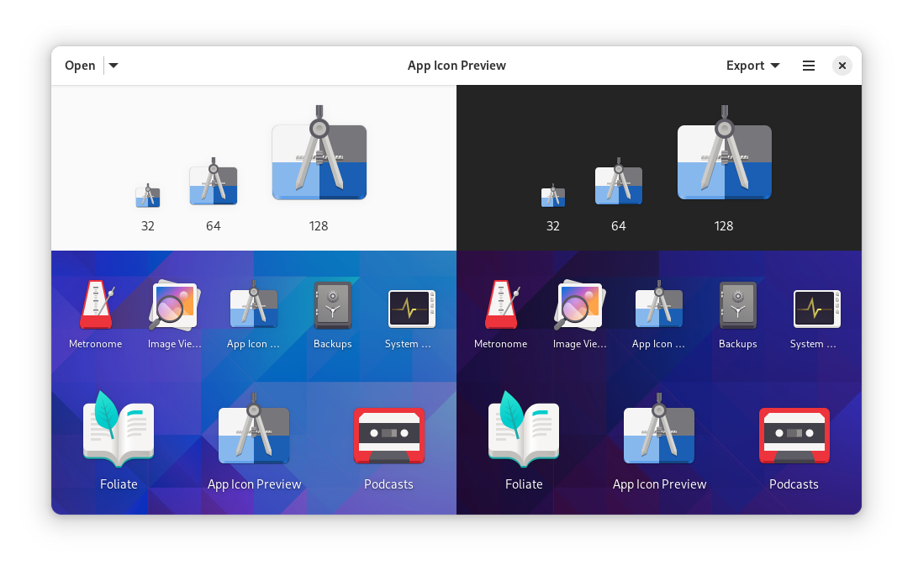

# App Icon Preview

Tool for designing applications icons.

## Screenshots

## Hack on App Icon Preview
To build the development version of App Icon Preview and hack on the code
see the [general guide](https://wiki.gnome.org/Newcomers/BuildProject)
for building GNOME apps with Flatpak and GNOME Builder.

You are expected to follow the GNOME Code of Conduct when participating in project
spaces.

